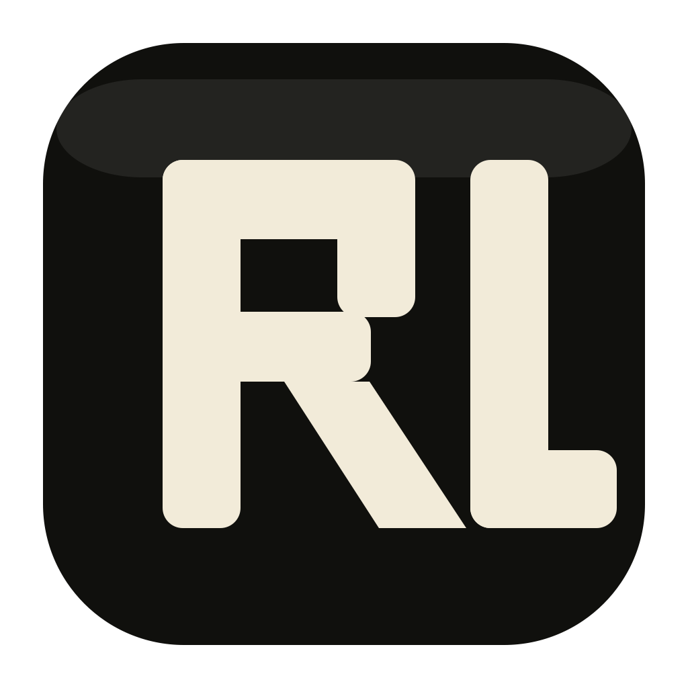

# RequestLab

<p align="center">
  
</p>

<p align="center">
  A native macOS API client for REST and GraphQL.
  <br />
  Fast to open, local-first, and not trying to become a browser tab with delusions of grandeur.
</p>

## Why RequestLab

RequestLab is an open-source macOS app built with SwiftUI and Swift Package Manager. It is designed for developers who want a lightweight native client for working with HTTP APIs, GraphQL operations, local workspaces, and environment variables without dragging an entire Electron apartment building into memory.

It currently focuses on the core workflow:

- Create and edit REST and GraphQL requests
- Organize requests in local workspace folders
- Load and save YAML-based workspaces
- Import Postman collection and environment JSON
- Resolve variables from global and collection-scoped environments
- Store secret variable values in macOS Keychain
- Send requests with `URLSession`
- Inspect response status, headers, body, timing, and local history

## Highlights

- Native SwiftUI macOS interface with a three-pane request workflow
- REST and GraphQL support, including operation name and variables
- Local-first workspace format backed by readable YAML files
- Collection-scoped environments layered over global environments
- Request validation before send
- JSON formatting helpers
- Secret environment values stored in Keychain instead of shared files
- Postman import support for bootstrapping existing API work
- Open-source Swift Package Manager project with a focused test suite

## Status

RequestLab is already usable for day-to-day API iteration, but it is still early-stage software. The foundation is in place and tested; the polish roadmap is still catching up.

Current scope includes:

- Workspace open, save, and save-as flows for `.workspace` folders
- Request editing for method, URL, params, headers, auth, body, and GraphQL fields
- Global and collection environment editing
- Response tabs for body and headers
- Request history stored in local app-private workspace state
- Release packaging for zipped macOS `.app` bundles

## Requirements

- macOS 14 Sonoma or later
- Xcode command line tools with Swift 6 support
- `rtk` for running repo commands

## Quick Start

```bash
rtk swift package resolve
rtk swift build
rtk ./script/build_and_run.sh
```

Useful development commands:

```bash
rtk swift test
rtk ./script/build_and_run.sh --verify
rtk ./script/package_release.sh
rtk swift script/generate_app_icon.swift
```

## Project Structure

```text
Sources/
  RequestLab/          SwiftUI app target
  RequestLabCore/      Domain models, persistence, execution, validation, services
Tests/
  RequestLabCoreTests/ Core test suite
Fixtures/
  SampleWorkspace.workspace/
Resources/
  AppIcon.icns
  app-icon.png
script/
  build_and_run.sh
  package_release.sh
  generate_app_icon.swift
```

Business logic lives in `RequestLabCore` so it can be tested without launching the UI. The app target owns SwiftUI views and app state.

## Workspace Format

Workspaces are folder-based and intentionally readable:

```text
Example.workspace/
  workspace.yaml
  collections/
    .order.yaml
    orders.yaml
  environments/
    .order.yaml
    local.yaml
  .client/
    history.yaml
```

- `workspace.yaml` stores workspace metadata
- `collections/` stores request collections
- `environments/` stores global environments
- `.order.yaml` files preserve ordering
- `.client/` stores local-only app state such as request history

Secret variables are written to shared YAML without values. Runtime values are stored in macOS Keychain using stable identifiers from the workspace and variable metadata.

## Testing

The current test suite covers:

- YAML workspace load and save round trips
- Fixture compatibility
- Request validation
- Variable resolution
- REST and GraphQL execution behavior
- Keychain secret storage
- Postman import mapping
- JSON formatting helpers
- Workspace editing behavior

Run the suite with:

```bash
rtk swift test
```

## Releasing

Create a zipped macOS app bundle with:

```bash
rtk ./script/package_release.sh
```

Release notes, signing, and checksum details live in [docs/RELEASE.md](./docs/RELEASE.md).

## Open Source

RequestLab is intended to be published as an open-source project. Before you flip the repo public, make sure the repository includes an explicit license file. Without one, other developers can read the code but do not automatically have permission to use, modify, or distribute it. That is not open source. That is just public suspense.

## Contributing

Issues and pull requests are welcome, especially around:

- macOS UX polish
- request editing ergonomics
- workspace interoperability
- import/export improvements
- testing and fixture coverage

Before sending changes:

```bash
rtk swift test
```

## Roadmap

Near-term improvements likely include:

- richer workspace sharing flows
- more request authoring ergonomics
- better response inspection and history tooling
- stronger release automation for public distribution

