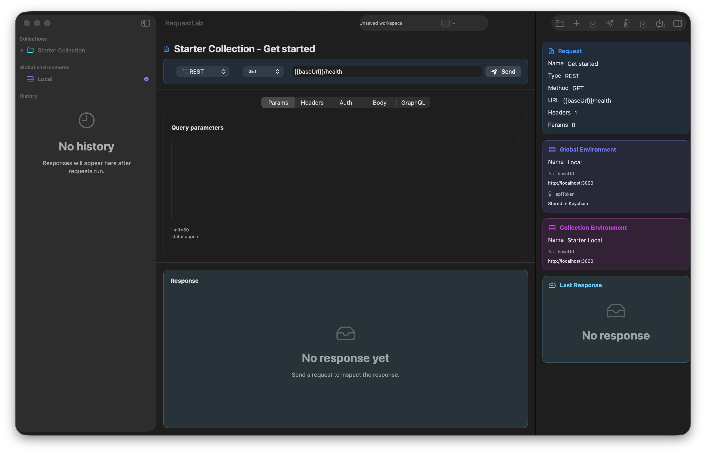

# RequestLab

<p align="center">
  
</p>

<h3 align="center">A native macOS API client for REST and GraphQL.</h3>

<p align="center">
  Fast to open, local-first, readable on disk, and not trying to become a browser tab with delusions of grandeur.
</p>

<p align="center">
  
  
  
  
</p>

<p align="center">
  
</p>

## What It Is

RequestLab is an open-source SwiftUI macOS app for working with HTTP APIs without hauling around an Electron moving truck. It gives you a native three-pane workspace for collections, requests, environments, response inspection, and local request history.

The project is built with Swift Package Manager. The UI lives in the app target, while request execution, workspace persistence, validation, import logic, variable resolution, and Keychain-backed secrets live in `RequestLabCore` so they can be tested without launching the app.

## Features

- Native SwiftUI macOS interface with a sidebar, request editor, and inspector
- REST request editing for method, URL, structured query params, headers, auth, and body
- GraphQL request support with operation name, query, and variables JSON
- Environment variables with global and collection-scoped layering
- Missing variable warnings before send, including highlighted unresolved tokens
- Duplicate variable-name warnings in environment editors
- Secret variable values stored in macOS Keychain instead of shared YAML files
- Local-first `.workspace` folders backed by readable YAML
- Workspace open, save, and save-as flows
- Postman collection and environment JSON import
- cURL import and copy-as-cURL export for selected requests
- Request validation before send
- Request execution through `URLSession`
- Response inspection for status, headers, body, duration, content type, and payload size
- Local request history with detail view, original-request open, and rerun actions
- Command palette for common workspace, import, create, send, and copy actions
- JSON formatting helpers for request bodies and GraphQL variables
- Release packaging for zipped macOS `.app` bundles

## Current Limits

RequestLab does not currently implement OAuth flows, cookie jars, a collection runner, scripting hooks, OpenAPI import, Insomnia import, team sync, cloud workspaces, or GraphQL schema exploration. Workspace sharing is file-based; secret values stay local in Keychain and are not included in shared YAML.

## Why It Exists

Most API clients eventually become a cloud workspace, a team billing page, and a Chromium process wearing a trench coat. RequestLab is intentionally smaller:

- Your workspace is a folder on disk.
- Your shared data is readable YAML.
- Your secrets stay in Keychain.
- Your app opens like a macOS app should.

That is the whole pitch. Shocking restraint, apparently.

## Requirements

- macOS 14 Sonoma or later
- Xcode command line tools with Swift 6 support
- `rtk` for repo commands

## Quick Start

```bash
rtk swift package resolve
rtk swift build
rtk ./script/build_and_run.sh
```

Useful development commands:

```bash
rtk swift test
rtk ./script/build_and_run.sh --verify
rtk ./script/package_release.sh
rtk swift script/generate_app_icon.swift
```

## Workspace Format

Workspaces are folder-based and intentionally boring, which is a compliment.

```text
Example.workspace/
  workspace.yaml
  collections/
    .order.yaml
    orders.yaml
  environments/
    .order.yaml
    local.yaml
  .client/
    history.yaml
```

- `workspace.yaml` stores workspace metadata.
- `collections/` stores request collections.
- `environments/` stores global environments.
- `.order.yaml` files preserve ordering.
- `.client/` stores local-only app state such as request history.

Secret variables are written to shared YAML without secret values. Runtime values are stored in macOS Keychain using stable identifiers from the workspace and variable metadata.

## Project Structure

```text
Sources/
  RequestLab/          SwiftUI app target
  RequestLabCore/      Domain models, persistence, execution, validation, services
Tests/
  RequestLabCoreTests/ Core Swift Testing suite
Fixtures/
  SampleWorkspace.workspace/
Resources/
  AppIcon.icns
  app-icon.png
  requestlab-screenshot.png
script/
  build_and_run.sh
  package_release.sh
  generate_app_icon.swift
```

Keep portable behavior in `RequestLabCore`. Keep SwiftUI state and presentation in `Sources/RequestLab`.

## Testing

The current suite covers workspace round trips, fixture compatibility, request validation, variable resolution, REST and GraphQL execution behavior, Keychain secret storage, Postman import mapping, JSON formatting, and workspace editing behavior.
It also covers cURL import/export and response/history metadata compatibility.

Run it with:

```bash
rtk swift test
```

## Releasing

Create a zipped macOS app bundle with:

```bash
rtk ./script/package_release.sh
```

Release notes, signing, and checksum details live in [docs/RELEASE.md](./docs/RELEASE.md).

## Contributing

Issues and pull requests are welcome, especially around:

- macOS UX polish
- request editing ergonomics
- workspace interoperability
- import/export improvements
- testing and fixture coverage

Before sending changes:

```bash
rtk swift test
```

## License

RequestLab is released under the [MIT License](./LICENSE).
